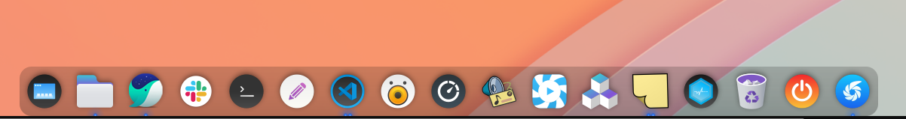
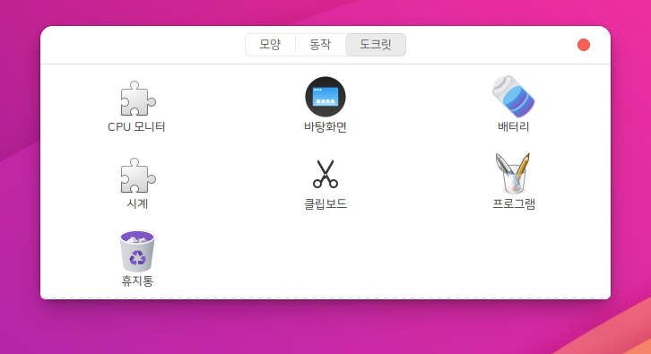
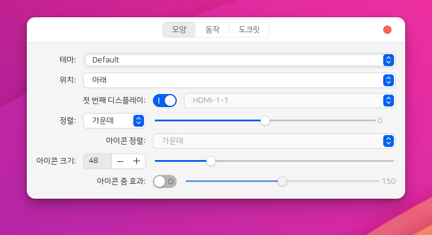

# plank - desktop Dock

하모니카OS의 바탕화면 독을 구성하는 프로그램
 * upstream version : 0.11.89 (https://github.com/ricotz/plank)







# Install

## HamoniKR (>= 3.0)
```
sudo apt update
sudo apt install -y plank
```
## Ubuntu (>= 18.04), LinuxMint (>= 19)
```
wget -qO- https://pkg.hamonikr.org/add-hamonikr.apt | sudo -E bash -
sudo apt plank
```

# License
 * [View license](https://github.com/ricotz/plank/blob/master/COPYING)